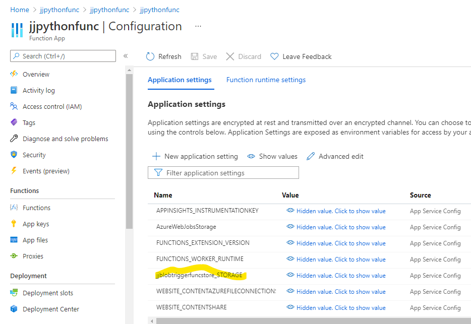
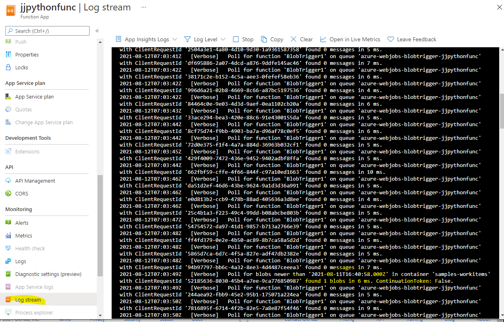
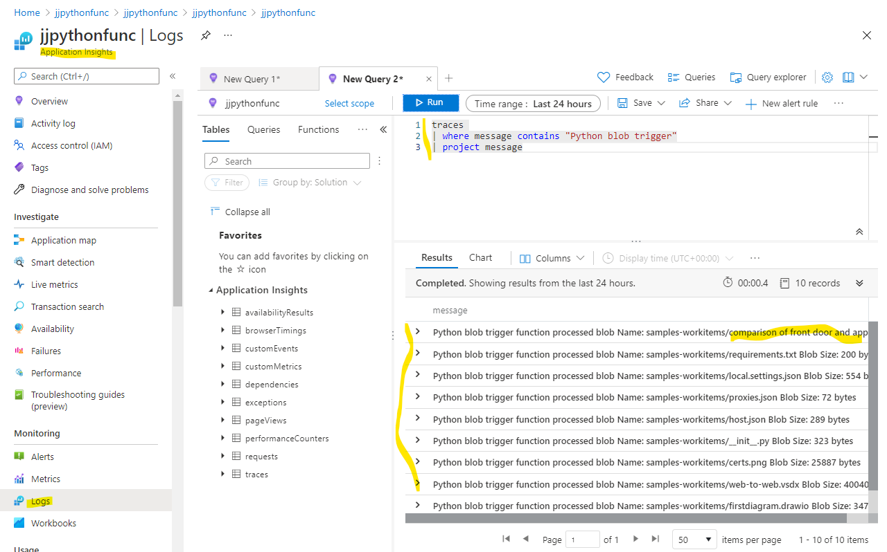

# Python Azure Function with blob trigger

This is a basic Python Azure function that triggers on a blob arriving in a container, then takes the file from the input and copies it to the output.


```
import logging

import azure.functions as func


def main(myblob: func.InputStream, outputBlob: func.Out[func.InputStream]):
    logging.info(f"Python blob trigger function processed blob \n"
                 f"Name: {myblob.name}\n"
                 f"Blob Size: {myblob.length} bytes")
    outputBlob.set(myblob)
```

The source and destination are defined in function.json

```
{
  "scriptFile": "__init__.py",
  "bindings": [
    {
      "name": "myblob",
      "type": "blobTrigger",
      "direction": "in",
      "path": "samples-workitems/{name}",
      "connection": "jjblobtriggerfuncstore_STORAGE"
    },
    {
      "name": "outputBlob",
      "type": "blob",
      "direction": "out",
      "path": "output/{name}",
      "connection": "jjblobtriggerfuncstore_STORAGE"
    }
  ]
}
```

The connection **jjblobtriggerfuncstore_STORAGE** needs to be set in the configuration section of the Azure function.




## Monitoring the function
The function invocation can be checked in the invocation section of the actual function (as opposed to the function app itself).


As can be see above, there are a number of invocations.

To see the activities of the function in real-time, you can select "Log Stream" at the level of the function app itself.



As can be seen above, this shows the engine-level log stream and you can see an item highlighted where a new blob has been detected. This view does not show you any diagnostics from the function itself. For that, you need to select application insights. This is a separate service to the function app. It will either have been created as part of creating the Azure function or the function can reference an existing application insights instance.



In the above, the "logs" section of the application insights has been selected, which allows you to look directly at log events generated by the function. The table "traces" refers to trace logs generated by the code in the function. In the case of our python function, there is a log entry that starts with the phrase *Python blob trigger*, so we can query for that:

```
traces 
| where message contains "Python blob trigger"
| project message
```
The above is the Kusto query language that is used by several Azure services.

## Summary

Python functions that are triggered from blob storage may be created in Visual Studio Code, tested locally and then uploaded. Monitoring the function can be done at a number of levels. This is a combination of monitoring capabilities in the function runtime and in application insights - the latter much better for monitoring the code of the function.
